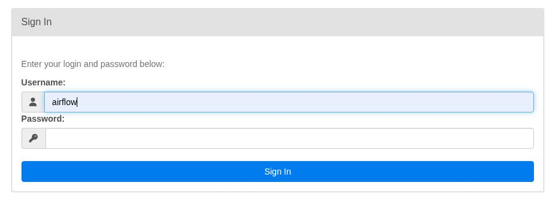
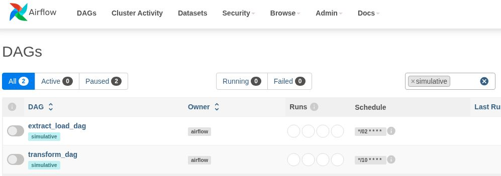
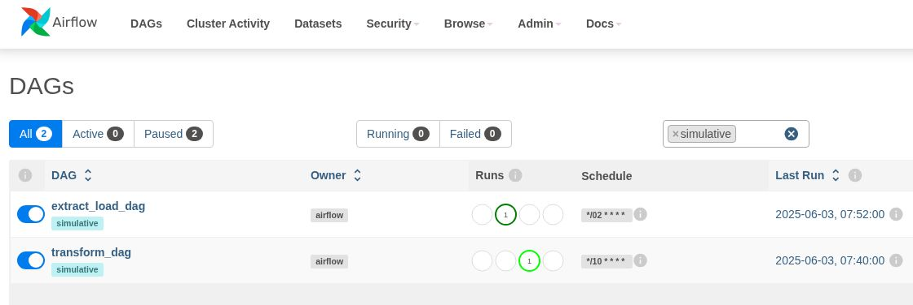

# ELT с вебинара Simulative Airflow

Полностью переработанный процесс ELT с вебинара Simulative Airflow.
Оригинальный проект расположен [здесь](https://github.com/rushawx/airflowWebinarSimulative)


## Файлы проекта:

- `./airflow/dags/extract_load_dag.py` - DAG для стадии 'Extract - Load'
- `./airflow/dags/transform_dag.py` - DAG для стадии 'Transform'
- `./fakerApi` - сервис, который генерирует данные о фейковой персоне
- `./init/pg/db.sql` - скрипт инициализации БД PostgreSQL
- `./init/ch/db.sql` - скрипт инициализации БД Clickhouse
- `./config/clickhouse/node1/` - конфигурационные файлы Clickhouse и Zookeeper
- `./Makefile` - набор инструкций make
- `./.env` - переменные окружения проекта
- `./docker-compose-services.yaml` - docker compose для запуска сервисов
- `./docker-compose-af.yaml` - docker compose для запуска Airflow
- `./.pre-commit-config.yaml` - настройки для pre-commit
- `./requirement.txt` - зависимости проекта
- `./pipeline.ipynb` - ноутбук для ручного тестирования процесса ELT

## Использование

- Убедиться, что на хосте установлен и запущен docker:
```sh
docker --version
```

- Убедиться, что на хосте установлен docker compose:
```sh
docker compose version
```

- Скачать оригинальный файл docker compose с сайта Airflow:
```sh
curl -LfO 'https://airflow.apache.org/docs/apache-airflow/3.0.1/docker-compose.yaml'
```

- Добавить в него строки из файла проекта docker-compose-af.yaml, ограниченные комментариями:
`#--- begin added for project simulative-airflow`
...
`#--- end`

- Скопировать файл docker-compose.yaml в docker-compose-af.yaml:
```sh
cp docker-compose.yaml docker-compose-af.yaml
```

- Запустить сервисы:
```sh
make services-up
```

- Запустить Airflow:
```sh
make af-start
```

- В браузере зайти на IP-адрес хоста с запущенным контейнером Airflow Webserver (порт 8080) 

- Ввести данные для входа на web-интерфейс Airflow:


- Отфильтровать нужные DAG с помощью тега 'simulative':


- Запустить на выполнение DAGs:
`extract_load_dag.py`
`transform_dag.py`


Наполнение таблиц баз данных PostgreSQL и Clickhouse можно контролировать с помощью
консольных клиентов psql, clickhouse-client, либо с использованием графических инструментов
типа DBeaver.

Параметры подключения указаны в файле .env, проброшенные порты - в файле docker-compose-services.yaml

## CI/CD

- Инициализировать в каталоге проекта репозиторий git:
```sh
git init
```

- Создать виртуальное окружение Python:
```sh
python3 -m venv .venv
```

- Активировать окружение:
```sh
source .venv/bin/activate
```

- Установить зависимости, необходимые для проекта:
```sh
pip install -r requirements.txt
```

- Инициализировать pre-commit:
```sh
pre-commit install
```

